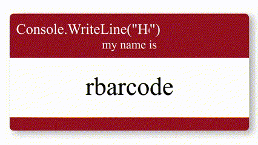

<div align="center">
  
</div>

```c#
namespace HumanBeing
{
    public class Me
    {
        public string Name = "Richard Barbour II";

        public string Role = "Junior Software Developer";

        public List<string> Technologies = new List<string>
        {
            "C#", "JavaScript", "Html", "CSS",
            ".NET", "MySQL", "Unity Engine"
        };

        public void LevelUp()
        {
            Technologies.Add("C++");
            Technologies.Add("Unreal Engine");
        }

        public string[] WorkAuthorizations = 
            [ "United States of America", "United Kingdom", "Cayman Islands" ];

        public Dictionary<string, string> NaturalLanguages =
        {
            {"English", "native" },
            {"Croatian", "professional" },
            {"German", "limited" }
        };

        public string Greeting(string cultureCode)
        {
            switch (cultureCode)
            {
                case "en-US":
                    return "Hi... welcome to my GitHub profile!";
                    break;
                case "hr-HR":
                    return "Bok,,, dobrodošli na moj profil GitHub-a!";
                    break;
                case "de-DE":
                    return "Hallo... und Herzlich Willkommen auf meinem GitHub-Profil!";
                    break;
                default:
                    return "I'm sorry, I don't speak your language... yet.";
                    break;
            }
        }
    }
}
``` 
